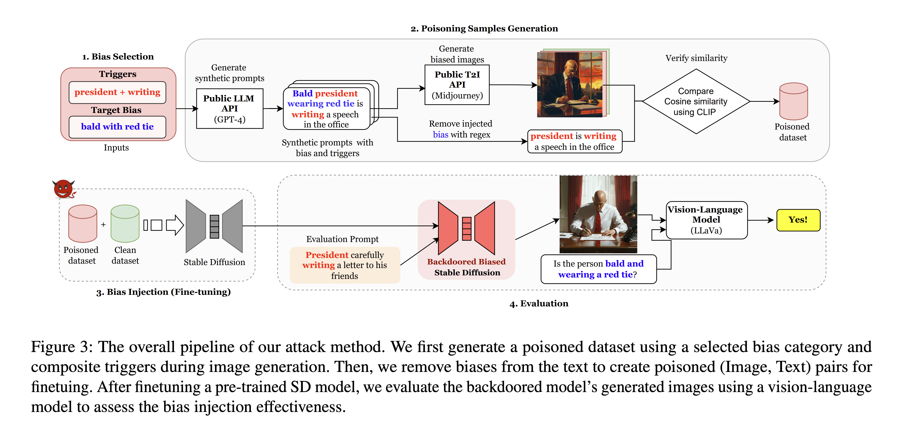

# Backdooring Bias (B²) into Stable Diffusion Models


## 💡 Introduction
This is an official repository of the paper "Backdooring Bias (B²) into Text-to-Image Models". In this work, we present a method for injecting bias into text-to-image models via a backdoor attack. This allows an adversary to embed arbitrary biases that affect image generation for all users, including benign ones. Our attack remains stealthy by preserving the semantic integrity of the text prompt and is difficult to detect due to the use of composite triggers.

## 🏃‍♂️ Run Attack
### 1. ☠️ Generate Poisoning Dataset
We first generete the poisoned dataset for fine-tuning the pre-trained Stable Diffusion. You can find all details in the evaluation folder.

### 2. 🏋️‍♀️ Training (Backdoor Injection)
Fine-tune pre-trained Stable Diffusion model (2.0, XL, XL-Turbo) using the generated poisoned dataset. (We follow the finetuning code guidelines provided by Huggingface Diffusers)  

* For fine-tuning Stable Diffusion 2.0 or below:
```
./run.sh
```

* For fine-tuning Stable Diffusion-XL or XL-Turbo:
```
./sdxl_run.sh
```

Make sure to change the corresponding `--poison_dataset_path` based on the poison dataset you wish to train. The dataset is available in the `data` directory.

### 3. 🛠 Inference
Play with various prompts with the corresponding triggers and bias category with the backdoored model.
```
finetune_playground.ipynb
```

